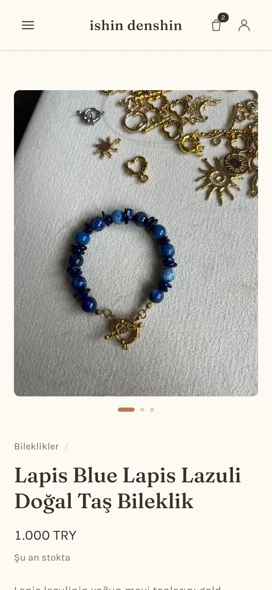
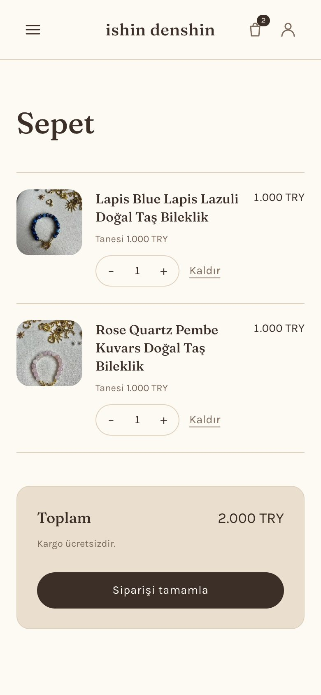
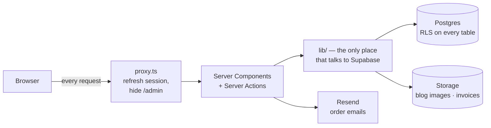

# ishin denshin

A real online shop for a small family jewelry business — handmade natural-stone
bracelets, sold in Turkey, run by one person from her phone.

**Live:** [ishindenshinstore.com](https://ishindenshinstore.com) ·
**Stack:** Next.js 16 (App Router) · React 19 · TypeScript · Tailwind v4 ·
Supabase (Postgres, Auth, Storage) · Resend · Vercel

<p>
  
</p>
<p>
  
  
  
  
</p>

---

## In one minute

This is not a tutorial project. A real person sells real bracelets through it,
and that changed every decision: money, stock, customer addresses and a
second-factor login all had to be right, not just look right.

**What it does**

- **Shop** — catalog, search and stone filter, product pages, a cart that
  survives a refresh.
- **Accounts** — sign up with email confirmation, sign in, password reset, order
  history. All emails in Turkish.
- **Checkout** — bank transfer (havale/EFT) against an order code. Stock is
  checked and taken in one database transaction, so two people cannot buy the
  last bracelet.
- **Admin panel** — the owner moves an order from *waiting for payment* → *paid*
  → *shipped* → *delivered*, attaches the invoice PDF, updates stock and writes
  blog posts. Every step emails the buyer. Hidden behind a 404 and a second
  factor.
- **Blog, legal pages, cookie notice, analytics.**

**By the numbers** — built in about two weeks (23 Aug – 7 Sep 2026): ~200
commits, 50 pull requests, 37 issues, 15 database migrations, ~200 tests that
run against a real Postgres.

**What I'd point a reviewer at**

| If you want to see… | Look at |
|---|---|
| Business rules enforced in the database, not the page | [`supabase/migrations/0011_one_pending_order.sql`](supabase/migrations/0011_one_pending_order.sql) — `place_order` |
| Security in layers | [`proxy.ts`](proxy.ts), [`lib/admin-guard.ts`](lib/admin-guard.ts), [`0008_admin_second_factor.sql`](supabase/migrations/0008_admin_second_factor.sql) |
| A bug that taught me something | [`lib/admin-write.ts`](lib/admin-write.ts) — the "saved" message that lied |
| Tests that prove access rules | [`tests/`](tests) — no mocks, real Postgres with the real policies |
| Server state vs client state | [`lib/stores/cart.ts`](lib/stores/cart.ts) and [`lib/products.ts`](lib/products.ts) |
| How work was planned | [Closed issues](../../issues?q=is%3Aissue+is%3Aclosed) — each epic specced before code |

---

## The one constraint behind everything

**The shop is run by one person, from her phone, who is not a developer.**

That one sentence explains most of this repo:

- There is an admin panel so she **never opens the database dashboard**.
- The blog lives in the database, not in markdown files, because **she cannot
  commit to git**.
- Every panel screen works one-handed on a phone.
- Anything that can go wrong must **say so clearly**, because there is no
  developer standing next to her.

---

## How it is built



**Where state lives, and why:**

| State | Lives in | Why |
|---|---|---|
| Search, filters, admin list state | The URL | It describes the page. It must survive a refresh and be shareable. |
| Cart | Zustand + localStorage | It describes the visitor, not the page. No account needed to shop. |
| Session | Cookies, refreshed in `proxy.ts` | Server components can read cookies, not localStorage. |
| Products, orders, posts, stock | Postgres | The one source of truth for anything a browser must not decide. |

The cart only stores `{ productId, quantity }` — **never a price**. The price is
read from the database when the order is placed, so an old tab or an edited
localStorage cannot change what someone pays.

---

## Decisions — what I chose, and why not the other option

Each one is a real choice that was argued before any code was written.

<details>
<summary><b>Supabase instead of writing my own backend</b></summary>

- **Chose:** Supabase — Postgres, auth, file storage and row-level security in
  one place.
- **Why:** I am a front-end developer. Auth, password resets and file storage
  are easy to get subtly wrong. Supabase gives them to me, and the rules still
  live in plain SQL I can read and test.
- **Why not Firebase:** orders, items and stock are relational data. I wanted
  real transactions and foreign keys, not documents I would have to keep in
  sync by hand.
- **Why not a custom Node API:** more code to secure, and nothing the shop
  needs that Postgres functions cannot do.

</details>

<details>
<summary><b>Bank transfer (havale/EFT), not a card payment provider</b></summary>

- **Chose:** the buyer gets an order code and the IBAN, pays by bank transfer,
  and the owner marks the order paid in the panel.
- **Why:** this is how small Turkish shops actually sell. A card provider needs
  a registered business and a business bank account — the shop does not have
  those yet.
- **What it cost:** the panel had to exist, because "paid" is now a human
  decision. It also created the *one unpaid order* rule below.
- **Next:** card payments, once the business paperwork is done.

</details>

<details>
<summary><b>Orders are written only by a Postgres function</b></summary>

- **Chose:** `place_order()` — one function, one transaction. It locks the
  product rows (`for update`), checks stock, takes today's price from the
  database, writes the order and its items, and lowers stock.
- **Why:** what makes an order correct (the real price, stock that really
  exists) cannot be decided by the browser. So the API has **no insert rights on
  orders at all** — the function is the only door.
- **Why not check stock in a Server Action and then insert:** two buyers can
  both pass the check before either one writes. Doing both inside one locked
  transaction removes that race.

</details>

<details>
<summary><b>One unpaid order at a time — enforced in the database</b></summary>

- **Rule:** a member with an order still waiting for payment cannot place
  another one.
- **Why:** with bank transfer, three unpaid orders means three codes against
  one payment, stock held three times, and three rows for the owner to match up
  by hand.
- **Why in Postgres and not on the page:** `place_order` is the only way to
  create an order, so a check there cannot be skipped. A check on the page is
  just decoration. It raises `unpaid_order_exists` with the outstanding code, so
  checkout can say *which* order to pay and link to it.
- **Left out on purpose:** auto-expiring unpaid orders (needs a scheduled job).
  The owner can cancel from the panel, which returns the stock and unblocks the
  buyer.

</details>

<details>
<summary><b>Three layers of access control for the admin panel</b></summary>

1. **`proxy.ts`** — anyone who is not the admin gets a **404** at any `/admin`
   path. Not a redirect to a login page: the route does not admit it exists.
2. **The page guard** — `requireVerifiedAdmin()`, in case a route is reached
   some way the proxy did not expect.
3. **Row-level security** — the database itself returns nothing and refuses
   every write, whatever any page decides.

The first two **fail open** (if I forget them, the page renders). RLS **fails
closed** (if I forget a policy, nothing is allowed). So the database is the real
lock; the other two are politeness and a second check.

**Second factor:** `is_admin()` is true only if the user is on the `admins`
list **and** has verified an authenticator code (`aal2`). A stolen password
alone reads nothing. The one exception is `/admin/security`, where the factor is
set up — it must work with a password only, or a lost phone locks the only
admin out of the page that fixes it. A test proves Supabase refuses every
dangerous action on that page without the second factor.

</details>

<details>
<summary><b>Tests against a real database, no mocks</b></summary>

- **Chose:** Vitest runs against a local Supabase in Docker. Every run drops the
  database, replays every migration and loads the seed data.
- **Why:** the access rules live in the database. A mocked Supabase client would
  pass happily with every policy missing. A test here is a statement about what
  Postgres will actually allow.
- **Test-first** from the checkout epic on — for server rules (stock, totals,
  who may read what). **Not** for layout or copy, where tests cost more than they
  catch.
- **What tests cannot catch:** see the migration bug below. Green tests against
  a local schema say nothing about production.

</details>

<details>
<summary><b>Caching: nothing is cached unless it says so</b></summary>

- The project uses `cacheComponents`. In Next 16 that means **nothing is cached
  by default** — only functions marked `use cache` are. Only the catalog reads
  in `lib/products.ts` are, tagged `products`.
- When stock changes, `updateTag("products")` clears **only** those entries.
- **Why `updateTag` and not `revalidateTag`:** the admin must see her own change
  immediately. Stale stock can sell a bracelet that is already gone.
- **Why all queries live in `lib/`:** one place to tag and clear. Pages never
  talk to Supabase directly.

</details>

<details>
<summary><b>A product added in the database works without a redeploy</b></summary>

- Product pages are prebuilt with `generateStaticParams`, but
  `dynamicParams` stays **on**, so a slug that was not built ahead of time is
  rendered on first visit.
- **Why not `dynamicParams = false`:** she adds products herself. With it off,
  every new product would be a 404 until someone redeployed.

</details>

<details>
<summary><b>Blog posts in the database, not markdown in the repo</b></summary>

- **Why:** a blog only a developer can update goes stale. She writes posts from
  `/admin/blog`; cover images upload straight from the browser to Supabase
  Storage, and the bucket policy does the admin check.
- **The slug is created once and never changes**, even if the title is edited.
  A shared link that breaks because a typo was fixed is worse than a slug that
  no longer matches its title.
- **Turkish slugs need special handling:** `ı`, `İ`, `ş`, `ğ` are their own
  letters, not accented ones, so the usual "strip the accents" trick leaves them
  in the URL. [`lib/slug.ts`](lib/slug.ts) folds them by hand. The same idea
  powers search: a normalised `search_text` column so "inci" finds "İnci".
- **No drafts, no comments** — on purpose. Comments mean a table, moderation
  screens and spam handling, for readers who do not exist yet.

</details>

<details>
<summary><b>Invoices are uploaded, not generated</b></summary>

- **Chose:** she issues the official e-invoice in the government system, then
  attaches the PDF in the panel. It goes out with the "payment received" email
  and appears on the buyer's order page.
- **Why not generate them:** an official invoice number comes from the tax
  authority. A number this app invented would not match the real records.
- **Private bucket + signed URLs** that expire after five minutes — an invoice
  has a name, address and phone number on it.
- **The write permission is on one column (`invoice_path`)**, not the whole
  orders table. A table-wide grant would let an admin session rewrite a status
  or a total directly and skip the order functions. A test tries exactly that
  and expects it to fail.

</details>

<details>
<summary><b>Order emails: sent after the change, never able to break it</b></summary>

- Emails go out **after** the database change commits. If Resend is down, the
  order still exists.
- The order-state functions are idempotent (pressing "paid" twice is safe), so
  emails are sent only when the state **actually changed** — otherwise a double
  tap would email the buyer twice.
- The owner gets exactly one email: the new-order notice. Status emails go only
  to the buyer — she is the one pressing the button.
- Without `RESEND_API_KEY` the app logs the email instead of sending it, so
  local development never mails a real person.

</details>

<details>
<summary><b>You cannot move an order backwards</b></summary>

- States: `beklemede` (waiting) → `ödendi` (paid) → `kargolandı` (shipped) →
  `teslim edildi` (delivered), plus `iptal` (cancelled).
- **Cancel is the only correction**, and cancelling returns stock exactly once.
- **Why not allow "un-ship":** a parcel with the courier is a fact in the real
  world. The database should not pretend otherwise.

</details>

<details>
<summary><b>Design: warm, light, Turkish-first</b></summary>

- Five visual directions were drawn; *Toprak* (earth) won — sand, clay and ink,
  with Fraunces and Karla.
- **The prettiest option (dark) was rejected**, because every product photo is
  shot on pale fabric. On a dark page they would become glowing rectangles
  until someone reshoots them.
- **Every font is checked for `ş ğ ı İ ç ö ü`** before it is used, or Turkish
  text falls back to another typeface mid-word.
- All copy uses the formal *siz*. A shop that is formal at checkout and casual
  on the product page reads like two different people wrote it.

</details>

<details>
<summary><b>Built on purpose to stay small</b></summary>

Considered and left out — none of these is an oversight:

- **Card payments** — needs the business registration first.
- **Blog comments and product reviews** — need traffic to mean anything.
- **Draft posts** — a column and a filter earning nothing yet.
- **Auto-expiring orders** — a scheduled job for something the owner can do in
  one tap.
- **Product create/edit in the panel** — built, then removed. She adds a new
  model a few times a year; stock is what changes daily, so the panel keeps
  stock only.
- **Automatic database migrations on merge** — that would put an irreversible
  production change behind a merge button. Migrations are pushed by hand, on
  purpose.

</details>

---

## Bugs worth remembering

The most useful part of this project. Each one taught me a rule I now apply
everywhere.

**1. All tests green, production broken.**
Saving a display name failed on the live site. Every test passed. The
`profiles` table existed only locally — the migration had never been pushed to
production. Migrations are not automatic, and tests run against the local
schema, so they could never see it.
→ *Rule: after merging a migration, push it and check production with one real
request. A green suite describes the local database, not the live one.*

**2. "Saved!" — but nothing was saved.**
The owner changed a stock number, saw *"Stok güncellendi"*, and the number
snapped back. Row-level security does not reject a blocked `UPDATE` — it
filters it. The update matches zero rows and returns **success with no error**.
Inserts fail loudly (`42501`); updates and deletes fail silently.
→ *Fix: [`lib/admin-write.ts`](lib/admin-write.ts). Every update asks for the
row back, and no row means "not saved". Pinned by a test.*

**3. The file that never ran.**
Next 16 renamed `middleware.ts` to `proxy.ts`. A file with the old name still
type-checks and lints — it just never runs. Sessions would have expired an hour
in with nothing in the logs. Found by reading the docs bundled in
`node_modules/next`, not my memory of older versions.
→ *Rule: on a new major version, read the installed docs before writing code.*

**4. A page congratulating strangers.**
`/welcome` said *"your email is verified"* to anyone who opened the URL —
because it was prerendered as static HTML, so it made a claim about the visitor
to every visitor. Now it checks the session with `getUser()` (which asks
Supabase to verify the token) instead of `getSession()` (which trusts whatever
the cookie says).

**5. Visit a 404, and the whole site turns black.**
Next's built-in 404 page ships its own dark-mode CSS. Client-side navigation
keeps the same document, so those styles stayed on every page after it until a
hard refresh. Fixed with our own `not-found.tsx` — which is also what a stranger
sees at `/admin`.

**6. Renaming the brand would have emptied every cart.**
The cart is saved in localStorage under a key with the old brand name. Renaming
a Zustand `persist` key is not a migration — Zustand looks under the new key,
finds nothing, and starts everyone with an empty cart. The storage adapter in
[`lib/stores/cart.ts`](lib/stores/cart.ts) reads the old key once, copies it to
the new one, and only then deletes the old one.

**7. One stock change cleared the whole site's cache.**
`revalidatePath("/", "layout")` threw away every cached page, blog included, to
update one number. The catalog was already tagged; nothing used the tag.
Swapped for `updateTag("products")`.

**8. The sign-in form that seemed to fail.**
After signing in on the way to checkout, the empty sign-in form stayed on screen
for a second, so it looked like it had failed. Next keeps the old page visible
while the next one streams, unless the next route has a `loading.tsx`. Adding
loading states fixed it.

**9. Smaller ones.**
Share previews pointed at `localhost:3000` in production (fixed by reading
Vercel's production URL at build time). `new Date()` in the footer failed the
build under `cacheComponents`. Vercel bakes environment variables in at build
time, so adding one needs a new deployment — and it has to be set for Preview
too, not only Production.

---

## How I worked

**Like a small team, on purpose.** Every change went through a GitHub issue, a
branch and a pull request, with small commits. `main` was never committed to
directly.

**Spec before code.** Each epic (accounts, checkout, admin panel, blog) started
with a "grill" session: every question that could change the build was asked
**up front, in one pass**, then written into an issue and split into tickets.
When questions leaked into the middle of a build, it felt like negotiating
instead of building — so the rule became: ask everything first, then build
without checking back.

**Built with Claude Code.** You will see `Co-Authored-By: Claude` on the
commits. I used it as a pair programmer, and I'm open about that:

- **My part:** what to build and why, every product and security decision above,
  the specs and issues, testing on real phones and Vercel previews, finding most
  of the bugs listed above by using the shop, reviewing and merging every PR.
- **Claude's part:** writing most of the code on branches, test-first, and
  explaining the backend parts — databases, SQL, row-level security — that were
  new to me as a front-end developer.
- **What I took from it:** I did not stop at "it works". I then studied the
  codebase topic by topic — Suspense, route handlers, Server Actions, caching,
  RLS, metadata, React internals — until I could explain the decisions in this
  README myself. The caching fix (bug 7) came out of that study.

---

## Running it locally

```bash
npm install
npm run dev
```

Create `.env.local` with:

```
NEXT_PUBLIC_SUPABASE_URL=...
NEXT_PUBLIC_SUPABASE_ANON_KEY=...
RESEND_API_KEY=...        # optional — without it, emails are logged instead
ORDER_EMAIL=...           # where the shop's new-order notice goes
```

**Tests** need Docker (or OrbStack) and the
[Supabase CLI](https://supabase.com/docs/guides/local-development):

```bash
supabase start
npm test
```

`npm test` rebuilds the test database from `supabase/migrations/` every run.

**Operating the live shop** — pushing auth config, granting the admin,
recovering a lost second factor, auth email redirects — is in
[`docs/operations.md`](docs/operations.md).

---

## Status

Built and deployed. The public launch is waiting on the business paperwork —
a shop cannot legally take repeated payments without it. Next up: card
payments, and the real text for the legal pages.

The bracelets and the product photos are the owner's own work.
